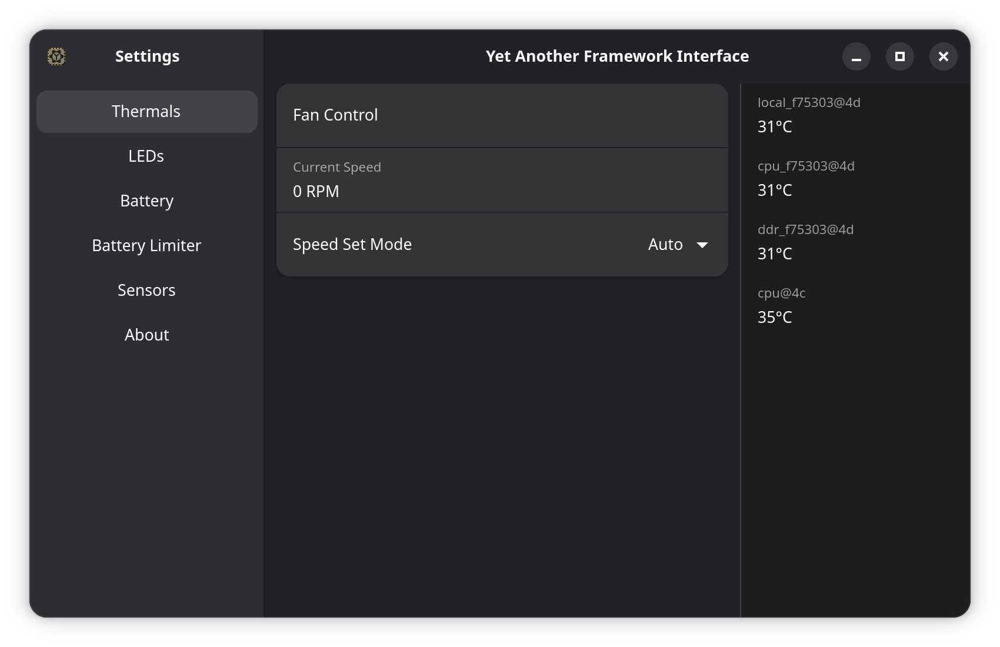
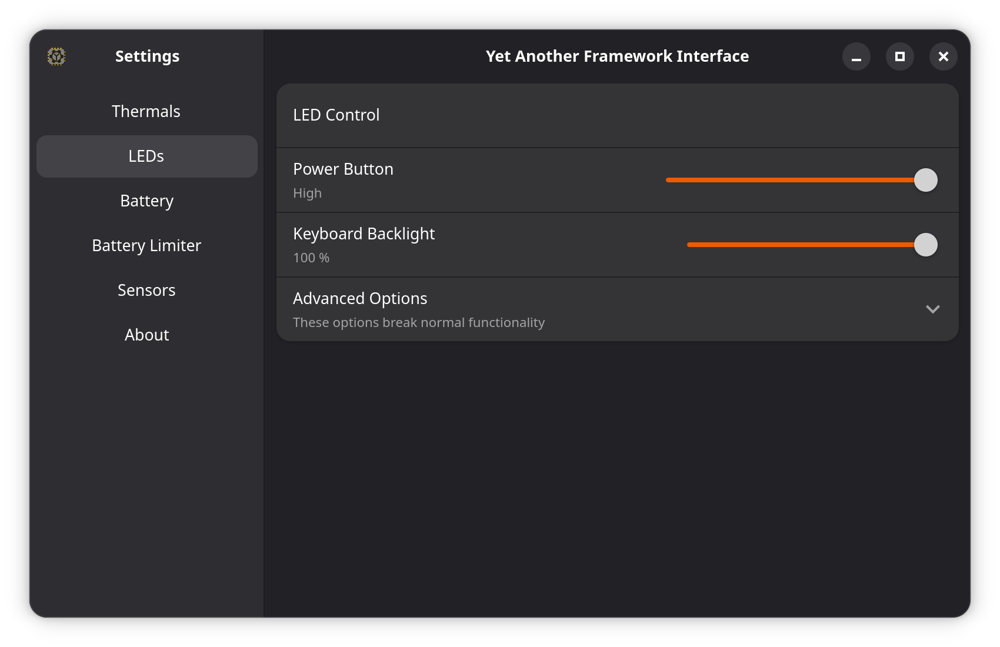
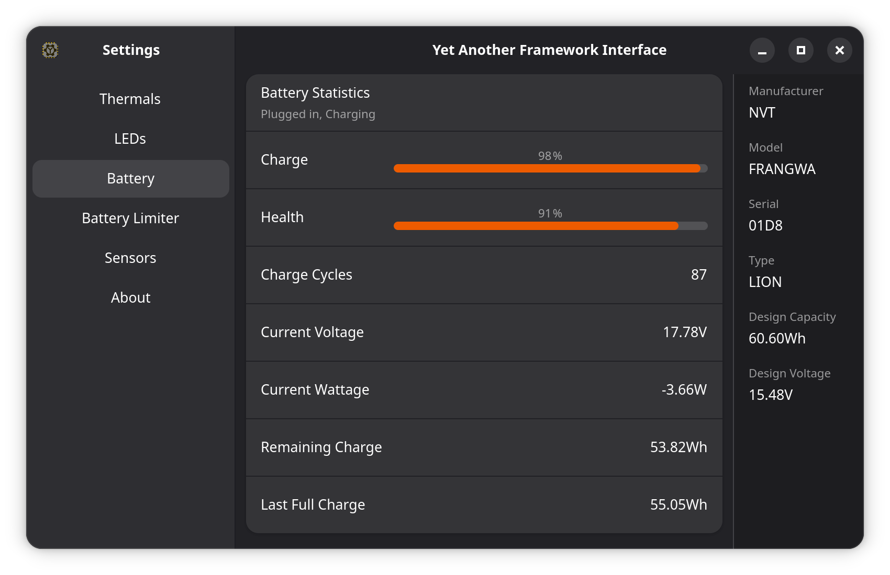

# Yet Another Framework Interface

YAFI is another GUI for the Framework Laptop Embedded Controller.
It is written in Python with a GTK4 Adwaita theme, and uses the `CrOS_EC_Python` library to communicate with the EC.

## Features

### Fan Control and Temperature Monitoring

### LED Control

### Battery Limiting

#### Battery Extender

### Hardware Info

## Installation

### udev Rules (MUST READ)

To allow YAFI to communicate with the EC, you need to copy the `60-cros_ec_python.rules` file to `/etc/udev/rules.d/` and reload the rules with `sudo udevadm control --reload-rules && sudo udevadm trigger`.

### Flatpak

Build and install the Flatpak package with `flatpak-builder --install --user build au.stevetech.yafi.json`.

You can also create a flatpak bundle with `flatpak-builder --repo=repo build au.stevetech.yafi.json` and install it with `flatpak install --user repo au.stevetech.yafi.flatpak`.
